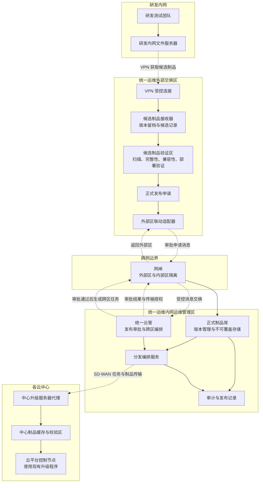
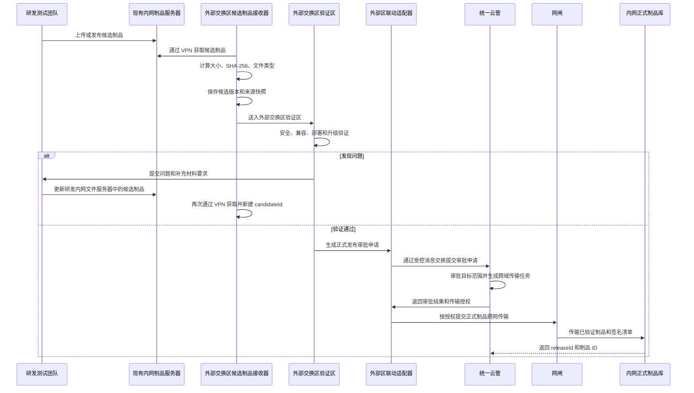
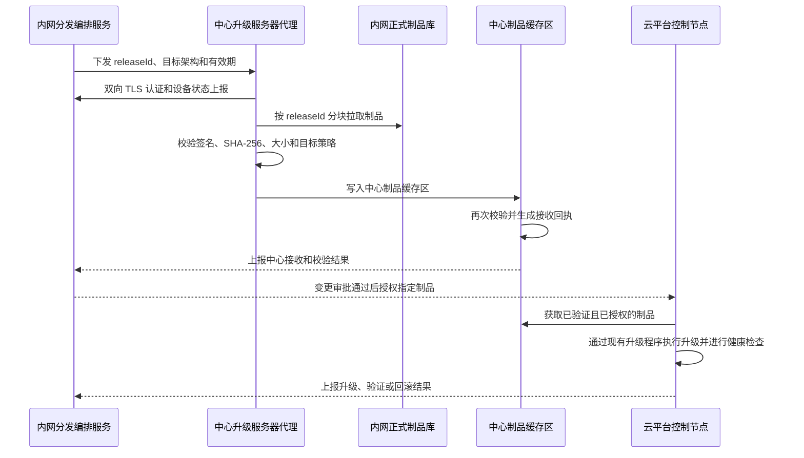
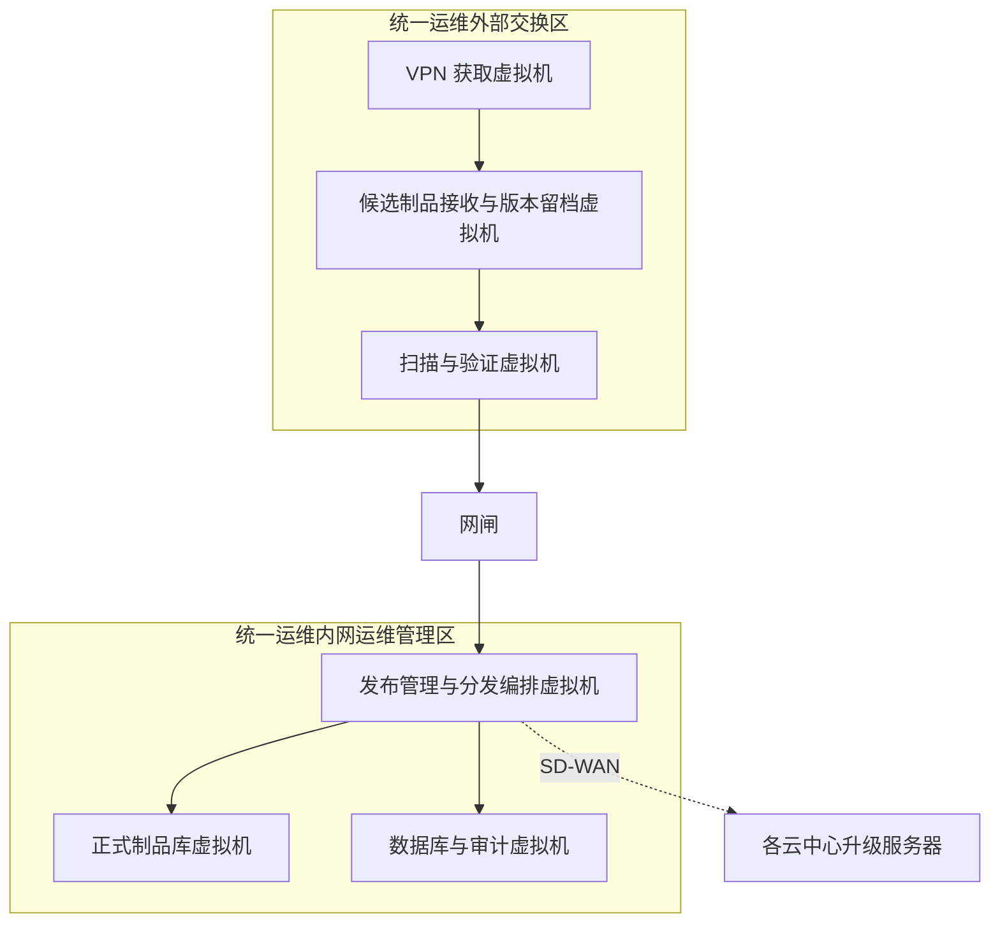

# Cloud Artifact Management

## 云平台软件制品管理系统设计

**工程名**：`cloud-artifact-management`  
**简称**：CAM  
**中文名称**：云平台软件制品管理系统  
**文档状态**：设计稿  
**适用范围**：云平台部署包、OTA 包、跨版本升级包、操作系统 ISO、镜像附加包、驱动包、存储组件包及其分卷文件

> 采用 `artifact` 而不是 `package`，因为系统管理的不只有软件包，还包括 ISO、镜像归档、驱动、依赖包和分卷制品。系统的正式交付对象统一称为“制品”。

## 1. 目标与边界

### 1.1 建设目标

CAM 建立从研发候选制品接收，到统一运维验证、正式发布、跨域传输、中心分发、升级执行和审计的完整链路，解决以下问题：

- 研发侧发布记录会更新，无法作为长期部署依据；
- 运维人员通过表格中的地址自行下载和拷贝，无法形成统一的信任链；
- 研发内网文件地址只能作为受控来源，不能直接作为各云中心的下载入口；
- 传输后的文件缺少统一的来源、完整性、适用范围和审批记录；
- 各中心的下载、接收、暂存和升级结果难以统一追踪。

### 1.2 系统边界

CAM 负责：

1. 接收研发候选制品及其来源信息；
2. 管理多轮验证、问题、研发回复和验证结论；
3. 固化统一运维确认后的正式发布基线；
4. 对制品和发布清单进行摘要计算、签名、扫描和校验；
5. 通过受控网闸和 SD-WAN 向各中心升级服务器分发；
6. 管理中心接收、暂存、再次校验和分发结果；
7. 保存审批、传输、升级、回滚和审计记录。

本设计不要求改造研发构建流程，也不强制替换统一运维人员的实际升级操作。升级执行可以保持现有控制节点操作方式，CAM 负责提供已经验证并授权的制品。

### 1.3 不属于系统职责的内容

- 研发代码托管、编译和 CI/CD 构建；
- 飞书表格的编辑和发布管理；
- 网闸设备本身的安全策略实现；
- SD-WAN 网络本身的路由和链路运维；
- 云平台升级脚本的业务逻辑。

## 2. 核心原则

### 2.1 两级发布记录

研发侧记录表示“候选制品已由研发提供”。

统一运维正式发布记录表示“该制品已经完成验证，可以进入云中心部署”。后续网闸传输、中心分发和升级操作只引用统一运维正式发布单号或制品 ID。

### 2.2 外部区完成验证，内部区只接收正式制品

外部交换区通过 VPN 访问研发内网文件地址，接收每次候选制品并完成版本留档、摘要计算、安全扫描、兼容性验证和部署验证。飞书表格或研发清单只作为来源信息，不能作为正式部署清单。验证通过后，外部交换区生成正式发布申请，经审批后通过网闸向内网传输。内网只接收已确认的正式制品，并负责版本管理、分发和审计。

### 2.3 制品不可覆盖

已经固化的制品文件、SHA-256、版本、适用范围和审批结论不可直接修改。发现问题时创建新的发布记录，并通过 `supersedes` 关系替代旧记录。

### 2.4 网闸传输不等于可信

网闸负责跨安全域交换文件。文件是否来自正确发布、是否完整、是否允许进入目标中心，由 CAM 通过清单签名、SHA-256、扫描结果和授权策略判断。

### 2.5 控制面推送，数据面拉取

内网分发服务向各中心下发分发任务。各中心升级服务器通过双向认证主动拉取制品。这样保持统一调度，同时减少中心对外暴露可写文件接收接口。

## 3. 总体架构



### 3.1 网络边界要求

- 研发内网文件服务器只允许统一运维外部交换区通过受控 VPN 访问；
- 外部交换区承担候选制品接收和验证，验证未通过的候选制品不得进入网闸发送队列；
- 网闸只表达外部交换区与统一运维内网之间的安全隔离，跨网传输对象是已审批的正式制品及其清单；
- 统一运维内网只接收正式制品，并负责版本管理、分发编排和审计；
- 各中心升级服务器是 SD-WAN 的数据接收端，控制节点不直接暴露给中央分发服务；
- 政务外网、互联网等不同安全域使用独立的分发任务、目标范围和权限策略；
- 中心升级服务器不访问研发内网文件服务器，也不根据研发清单中的地址自行下载。

## 4. 角色与职责

| 角色 | 主要职责 |
|---|---|
| 研发发布人 | 提供候选制品、版本说明、适用范围和研发侧摘要 |
| 制品接收人 | 通过 VPN 从研发内网文件服务器获取候选制品，确认来源和接收结果 |
| 验证人员 | 在外部交换区执行完整性、安全性、兼容性和部署验证，记录问题与结论 |
| 统一云管审批人 | 在统一云管中审批正式发布、目标中心和跨域传输 |
| 网闸管理员 | 维护交换设备策略和交换任务状态，不修改制品内容 |
| 分发管理员 | 创建中心分发任务，处理失败和重试 |
| 中心运维人员 | 管理本中心升级服务器和控制节点暂存区 |
| 统一运维人员 | 参与变更审批、升级授权和结果复核，不作为制品传输链路的终点 |
| 审计人员 | 查询不可篡改的发布、传输、升级和审批证据 |
| 系统管理员 | 维护账号、证书、密钥、策略和系统参数，不参与业务审批 |

建议将验证人员与统一云管审批人分离；系统管理员、网闸管理员不应拥有修改制品内容或批准发布的权限。

## 5. 业务流程

### 5.1 候选制品接收与验证

研发发包流程保持不变。外部交换区通过受控 VPN 访问研发内网文件服务器，候选制品接收器为每次获取生成新的 `candidateId`，并保存版本快照。



验证过程中的多次交涉应形成验证记录。研发内网文件更新后，外部交换区已接收的候选版本和来源快照不变。验证通过后，外部交换区向统一云管提交正式发布审批申请；只有统一云管审批通过并生成跨域传输任务后，制品才允许跨网闸进入内网。

### 5.2 内部正式发布

正式发布时系统完成以下动作：

1. 生成待审批的发布申请编号和 `artifactId`，并保留候选版本链；
2. 将候选制品在外部交换区标记为待审批对象；
3. 计算 SHA-256，并与研发声明的摘要进行比对；
4. 生成待审批发布清单，审批通过后再使用统一运维发布签名密钥签名；
5. 记录目标安全域、中心范围和前置版本；
6. 向统一云管提交正式发布审批申请；
7. 统一云管审批通过后生成正式 `releaseId`，将发布状态置为 `SEALED`，并生成跨域传输任务。

如果同一产品版本再次收到不同摘要的文件，应视为新的制品，不得覆盖原记录。系统应提示“同版本不同摘要”，并要求审批人确认替代关系。

### 5.3 网闸跨域交换

外部交换区验证通过后，先向统一云管提交审批。统一云管完成审批、目标范围确认和跨域传输任务编排后，才将正式制品提交网闸。网闸用于隔离外部交换区和内网，不承载两侧业务系统的直接网络连接。跨网闸交换包是一次传输任务的封装目录，不是新的软件包格式，也不会替换研发提供的原始文件名。示例：

```text
transfer-bundle/
  payload/
    cloud-base-8.0.6.2-20260916_194146-amd64.tar.gz  原始制品文件
  manifest.json                                      正式发布清单
  manifest.sig                                       发布清单签名
  parts/                                              分卷文件及分卷摘要（如有）
  scan-result.json                                    外部交换区验证结果
  transfer-request.json                               网闸交换申请和目标安全域
```

这些文件之间的关系如下：

| 层级 | 示例 | 作用 |
|---|---|---|
| 原始制品文件 | `cloud-base-8.0.6.2-20260916_194146-amd64.tar.gz` | 真正用于部署或升级的软件包，保留研发提供的原始文件名 |
| 正式发布清单 | `manifest.json` | 描述原始制品的文件名、大小、版本、架构、SHA-256、适用范围和前置版本 |
| 清单签名 | `manifest.sig` | 证明 `manifest.json` 由统一运维发布签名密钥生成，且清单未被修改 |
| 验证结果 | `scan-result.json` | 记录外部交换区对原始制品执行的扫描和验证结论 |
| 传输申请 | `transfer-request.json` | 描述本次网闸传输的来源、目标安全域、发布单号和传输任务 |
| 分卷目录 | `parts/` | 仅在制品被拆分传输时保存分卷文件及分卷摘要，最终仍以合并后原始制品的 SHA-256 为准 |

因此，`manifest.json` 不是另一个软件包，而是原始制品的说明和校验凭据；网闸交换包则是把原始制品、发布清单、签名和传输记录放在一起，便于跨域传输和接收端核验。系统中的 `artifactId` 标识这份制品，`releaseId` 标识统一运维确认的一次正式发布，`fileName` 则记录研发提供的原始文件名。

发送端只允许发送统一云管审批通过并由其生成传输任务的 `SEALED` 制品。内网接收端不重新执行外部验证流程，而是完成传输完整性、签名、目标范围和状态检查后，才可以登记为正式制品：

- 交换任务是否有效且未撤销；
- 签名证书是否可信、是否在有效期内；
- manifest 签名是否正确；
- 文件大小和 SHA-256 是否一致；
- 目标安全域、产品、架构和版本是否匹配；
- 扫描结果是否通过；
- 是否存在重放、过期或重复接收风险。

内网登记成功后，正式制品进入版本管理和分发流程。内网接收校验失败时，制品不得进入正式制品库，传输任务回退为失败状态并要求重新交换。统一云管保存审批单号、跨域任务状态和内网接收回执，形成外部验证、审批、网闸交换和内网接收的关联链路。

### 5.4 中心分发与控制节点暂存



内网分发服务下发的是任务和制品 ID，中心代理获取的是已批准制品。云平台控制节点只使用中心缓存区中校验通过且已获变更授权的制品。统一运维人员通过现有运维系统完成变更审批，在控制节点上调用已有升级脚本、命令或升级程序执行操作，并负责结果复核。这里不新增独立的“升级执行器”平台，升级仍由控制节点现有的升级程序完成。

### 5.5 回滚

回滚只允许选择同一产品、同一目标架构、经过内部正式发布的历史制品。回滚任务必须关联原升级任务，并记录：

- 回滚原因；
- 回滚目标版本和制品 ID；
- 审批人；
- 实施时间；
- 验证结果。

## 6. 制品清单

发布清单是跨系统传输的信任载体，也是对原始制品文件的结构化描述。它不替代原始制品文件，`fileName` 字段应与 `payload/` 目录中的实际文件名一致。示例：

```json
{
  "releaseId": "OPS-REL-20260928-001",
  "candidateId": "CAND-20260928-004",
  "artifactId": "sha256:b7...e91",
  "product": "Stack",
  "version": "8.0.6.2",
  "artifactType": "cloud-platform-bundle",
  "fileName": "cloud-base-8.0.6.2-20260916_194146-amd64.tar.gz",
  "sizeBytes": 7301444403,
  "architecture": "x86",
  "sha256": "b7...e91",
  "legacyMd5": "b0cbb07d238479fd75384f63cd6f4b48",
  "sourceReference": "研发发布记录快照 ID",
  "targetDomains": ["government-network", "internet"],
  "prerequisites": ["8.0.5.630-latest-patch"],
  "parts": [],
  "signedBy": "CAM Release Signing Key 01",
  "issuedAt": "2026-09-28T15:30:00+08:00",
  "expiresAt": "2027-09-28T15:30:00+08:00",
  "approvalId": "UC-APP-20260928-001",
  "transferTaskId": "UC-TRANSFER-20260928-001",
  "status": "SEALED"
}
```

分卷制品应额外记录分卷顺序、每个分卷大小和每个分卷 SHA-256，同时保留合并后完整包的 SHA-256。网络传输优先使用支持断点续传的完整制品；分卷主要用于光盘或其他受限介质交付。

清单中不保存下载凭证。需要保留来源时，保存研发内网文件服务器路径、VPN 获取时间和研发来源记录快照 ID；VPN 访问凭据由外部交换区的受控身份和密钥机制管理，不进入发布清单。

## 7. 安全控制

### 7.1 来源和完整性

- SHA-256 为正式完整性校验算法；MD5 仅用于兼容现有清单；
- 由 CAM 重新计算摘要，不直接信任研发填写的摘要；
- 发布清单使用组织内部签名密钥签名；
- 签名私钥放在 KMS、HSM 或等效的受控密钥环境中；
- 接收端、网闸接收区、中心升级服务器和控制节点暂存区都要校验；
- 同一版本不同摘要必须触发人工确认；
- 撤销发布后，分发服务不得继续创建新的分发任务。

### 7.2 访问控制

- 研发人员只能提交候选制品；
- 验证人员可以执行验证，但不能批准正式发布；
- 发布审批人可以固化基线，但不能修改已固化文件；
- 网闸管理员可以执行交换策略，但不能改变制品清单；
- 中心运维人员只能访问授权给本中心的制品；
- 系统管理员不能代替业务审批；
- 所有中心代理使用设备证书和双向 TLS 认证。

### 7.3 隔离和扫描

- 外部交换区的候选接收与验证环境同内网正式制品库隔离；
- 验证通过并审批的制品通过网闸单向进入内网正式制品库；
- 对 ISO、压缩包、镜像归档和脚本执行病毒扫描及格式检查；
- 解包扫描时检查路径穿越、符号链接、危险脚本和异常文件；
- 大包使用分块传输，但以完整文件 SHA-256 作为最终判断；
- 制品库启用对象锁定、版本保护或等效的不可覆盖能力；
- 审计日志写入追加式存储，并使用统一时间源。

## 8. 部署分区

外部交换区部署候选接收和验证组件；内网运维管理区至少部署以下逻辑组件：

- 发布与分发门户；
- 正式制品库；
- 发布签名服务或 KMS/HSM 接入；
- 网闸内侧接收适配器；
- 分发编排服务；
- 审计日志服务；
- 各中心升级服务器代理。

外部交换区至少部署 VPN 客户端/网关、候选制品接收器、候选版本库、验证工具和正式发布申请功能。外部交换区与内网正式制品库之间不得共享存储。

对于 13 GB、19 GB 级别的大包，接收区、扫描区和正式制品库应预留不少于最大制品 3 倍的可用空间，以覆盖分块文件、完整文件和扫描副本。SD-WAN 分发应支持断点续传、限速、失败重试和维护窗口，避免占用生产运维流量。

### 8.1 小规模虚拟化部署

在云平台规模不大、并发验证和分发任务较少的情况下，系统可以采用三类虚拟机部署。每类虚拟机先按统一规格规划：

```text
16 vCPU
32 GB 内存
2 TB 可用虚拟存储
```

部署位置如下：

| 部署位置 | 虚拟机数量 | 主要职责 |
|---|---:|---|
| 统一运维外部交换区 | 1 台 | 通过 VPN 获取研发候选制品、版本留档、扫描和验证 |
| 统一运维内网 | 1 台 | 保存正式制品、维护发布记录、版本管理、分发编排和审计 |
| 每个云中心或独立安全域 | 1 台 | 接收 SD-WAN 分发任务、缓存制品、校验制品并提供给控制节点 |

研发内网文件服务器、网闸和云平台控制节点使用现有环境，不计入 CAM 新增虚拟机数量。一个云中心如果包含政务外网、互联网等相互隔离的安全域，应按安全域分别部署升级服务器，不能跨安全域共用同一台升级服务器。

三类虚拟机的 2 TB 是首期可用虚拟存储基线，分别用于候选制品和验证临时文件、正式制品和发布记录、中心缓存和回滚版本。虚拟化环境中的存储可靠性、备份和扩容由现有虚拟化存储平台统一提供，本文不限定底层物理磁盘组织方式。

### 8.2 拆分部署设计

当候选制品数量、验证并发量、正式版本保留量或云中心数量增加时，可以按功能拆分虚拟机，不改变总体架构和数据流向。拆分方式如下：



拆分后的建议职责为：

| 虚拟机 | 主要职责 |
|---|---|
| VPN 获取虚拟机 | 仅负责访问研发内网文件地址和下载候选制品，不承载正式制品库 |
| 候选接收虚拟机 | 保存候选版本、来源快照和接收记录 |
| 扫描与验证虚拟机 | 执行安全扫描、完整性校验、兼容性和部署验证 |
| 发布管理与分发编排虚拟机 | 管理正式发布、网闸传输申请、中心分发任务和权限 |
| 正式制品库虚拟机 | 保存不可覆盖的正式制品和版本索引 |
| 数据库与审计虚拟机 | 保存发布记录、任务记录、验证证据和审计日志 |
| 云中心升级服务器 | 缓存和校验正式制品，并向本中心控制节点提供升级文件 |

小规模部署时，上述功能可以合并在统一运维外部交换区和统一运维内网各一台虚拟机中；拆分部署时，候选接收、验证、发布管理、制品存储和数据库审计分别承担独立职责。无论采用合并还是拆分方式，候选制品验证环境都不应与内网正式制品库存储共享，正式制品仍必须经过网闸进入统一运维内网。

### 8.3 统一云管联动

正式制品从外部交换区进入统一运维内网时，建议由统一云管作为审批和编排入口。外部交换区不直接决定网闸传输，内网制品库也不接受没有统一云管审批关联的跨域文件。

内外网之间需要联动接口，但接口不意味着外部区与内网直接联网。应在网闸两侧分别部署联动适配器，通过受控消息、接口代理或网闸支持的文件交换回执传递审批和状态信息，不应让外部区和内网直接共享数据库、共享文件目录或开放任意文件上传接口。建议保留以下三类联动：

1. **外部交换区联动适配器到统一云管联动适配器：**提交候选制品验证结果、正式发布清单摘要、制品大小、目标范围、前置版本和验证证据地址，申请统一云管审批。
2. **统一云管联动适配器到外部交换区联动适配器：**返回审批结果、审批单号、正式 `releaseId`、目标安全域、有效期和传输任务编号。外部交换区只有收到批准任务后，才将制品送入网闸发送区。
3. **内网接收区到统一云管联动适配器：**回传网闸接收结果、文件大小、SHA-256、签名校验结果、内网正式登记编号和失败原因。统一云管据此更新跨域传输和正式入库状态。

这三类接口可以采用统一云管提供的 HTTPS 服务、消息队列或受控文件交换回执实现，具体形式取决于现有统一云管和网闸能力。接口传输的重点是清单和状态，不是跨区实时传输大文件；大文件仍通过网闸完成交换。每次接口调用都应带有 `approvalId`、`releaseId`、`artifactId` 或 `transferTaskId`，保证审批、文件和传输回执可以相互关联。

