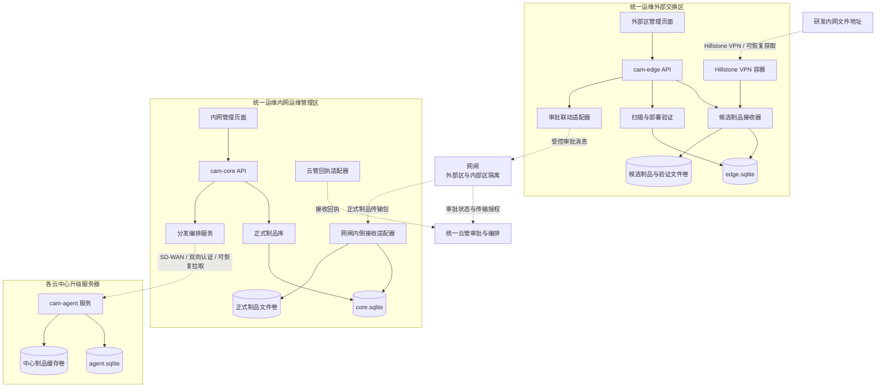
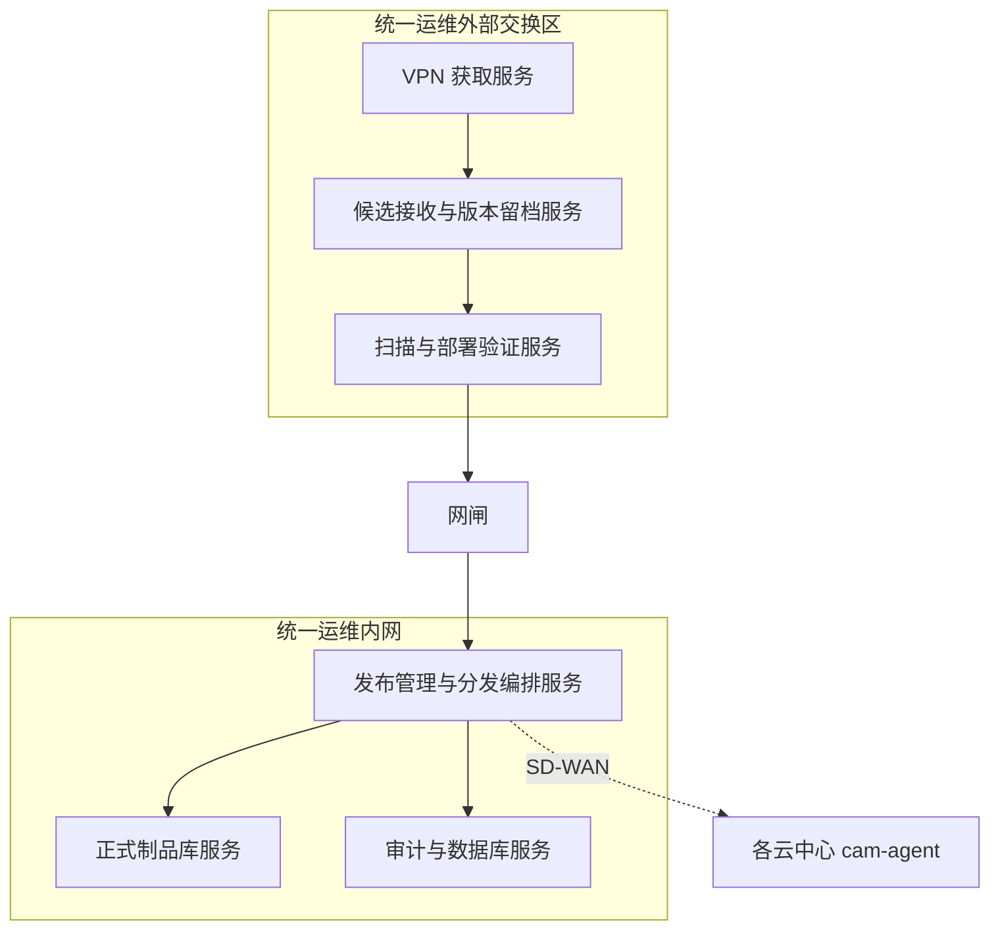
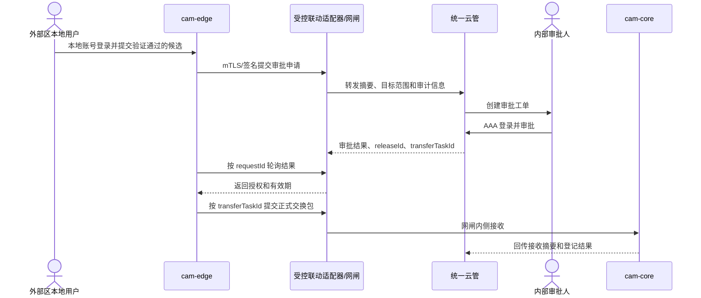

# 云平台软件制品管理系统技术方案

**工程名**：`cloud-artifact-management`  
**系统简称**：CAM（Cloud Artifact Management）  
**文档定位**：后续开发、部署、组件审计和运行维护的技术依据  
**对应架构文档**：`docs/system-design.md`  
**文档状态**：技术方案基线

## 1. 文档定位

本文档描述 CAM 的技术实现边界和工程约束。它与 `system-design.md` 分开维护：

- `system-design.md` 面向业务、总体架构和跨安全域流程，用于方案沟通和评审；
- `technical-solution.md` 面向开发、部署和运维，规定语言、框架、镜像、数据存储、传输和安全实现；
- 两份文档中的名称、区域边界和制品关系应保持一致。技术实现不得绕过架构文档定义的外部交换区、网闸、统一运维内网和云中心边界。

## 2. 技术决策

### 2.1 总体选型

CAM 采用 JavaScript 全栈实现，服务端、管理页面和共享库统一使用 ECMAScript Modules。首期不引入 Java、JVM、中间件集群或需要独立守护进程的基础设施。

| 层次 | 选型 | 约束 |
|---|---|---|
| 运行时 | Node.js 24 LTS | 锁定大版本和补丁版本；生产镜像不得运行时安装依赖 |
| 服务框架 | Fastify | 使用原生插件机制；路由、鉴权、审计和错误处理集中注册 |
| 模块系统 | ECMAScript Modules | `package.json` 设置 `type: module`；禁止混用未审计的 CommonJS 运行时包装层 |
| 管理页面 | AdminLTE 4 + Bootstrap 5 | 静态资源随镜像发布，不使用 CDN |
| 页面脚本 | 原生 JavaScript ES Modules | 不引入 Vue、React、Angular 或大型状��管理框架 |
| Excel 清单读取 | `read-excel-file@9.3.12` | 仅在 `cam-edge` 服务端解析 `.xlsx`；固定版本并审计全部传递依赖，限制上传大小和行数 |
| Excel 清单读取 | `read-excel-file` | 仅在 `cam-edge` 服务端解析 `.xlsx`；固定版本并审计全部传递依赖，限制上传大小和行数 |
| 数据库 | Node.js 内置 `node:sqlite` | 每个安全区使用独立 SQLite 文件，不共享数据库文件 |
| 制品文件 | 宿主机本地持久化目录 | 元数据和文件分离；正式制品不可覆盖 |
| 容器 | Docker Engine + Docker Compose | 使用内部镜像仓库；不首期引入 Kubernetes |

`node:sqlite`、Fastify、AdminLTE、Bootstrap、Node.js 基础镜像和所有 npm 依赖都必须纳入开源组件审计。若目标环境中的 Node.js 24 LTS 构建尚未通过审计，应暂停升级到未审计版本，不得用未经批准的外部数据库替代。

### 2.2 明确不引入的组件

首期不使用 MySQL、PostgreSQL、MongoDB、Redis、Kafka、RabbitMQ、ORM、服务网格、Kubernetes、外部对象存储和公有云 CDN。

这些组件不是永久禁止项；若后续规模导致 SQLite 或单机文件卷不能满足要求，必须先完成容量、可用性、安全审计和迁移设计，再单独变更技术基线。

### 2.3 设计目标

技术方案需要同时满足：

1. 外部交换区、统一运维内网和各云中心的数据隔离；
2. 大文件可恢复传输，网络中断不要求从零开始；
3. 文件摘要、清单签名、审批和传输回执可关联追溯；
4. 依赖可离线构建，生产环境不访问公网；
5. 单实例部署可通过优雅更新完成短时切换，后续可平滑拆分为多实例。

## 3. 技术架构



控制面只传递候选摘要、审批、授权、任务和状态；大文件在允许的传输链路上交换。外部交换区与内网不共享数据库、共享目录或任意文件上传接口。

## 4. 工程和服务划分

### 4.1 工程目录

```text
cloud-artifact-management/
├─ apps/
│  ├─ cam-edge/                 # 外部交换区服务
│  ├─ cam-core/                 # 统一运维内网服务
│  └─ cam-agent/                # 各云中心升级服务器服务
├─ libs/
│  ├─ cam-manifest/             # 清单、摘要和签名
│  ├─ cam-crypto/               # 密钥接口和密码操作封装
│  ├─ cam-transfer/             # 分块、续传、重试和合并
│  ├─ cam-sqlite/               # SQLite 连接、迁移和事务封装
│  └─ cam-protocol/             # 区内 API 和跨区消息结构
├─ web/
│  ├─ index.html                # 外部交换区管理页面入口
│  ├─ app.js                    # 页面交互和候选任务操作
│  └─ app.css                   # 页面定制样式
├─ web.Dockerfile               # Caddy、静态资源和反向代理镜像
├─ deploy/
│  ├─ docker/                   # Dockerfile、启动脚本和健康检查
│  ├─ compose/                  # edge、core、agent 部署文件
│  └─ offline/                  # 离线构建物料清单和校验文件
├─ migrations/                  # 按安全区分组的 SQLite 迁移
├─ package.json
├─ package-lock.json
└─ README.md
```

共享库只放无安全区状态的纯函数或协议实现。数据库连接、文件路径、密钥和运行配置不得放入共享库的全局变量。

### 4.2 镜像和服务职责

| 镜像 | 部署区域 | 服务职责 | 不负责的事项 |
|---|---|---|---|
| `cam-edge-web` | 统一运维外部交换区 | AdminLTE 管理页面、静态资源和 `/api/*` 反向代理到 `cam-edge` | 业务数据持久化、跨区传输和审批决策 |
| `cam-edge` | 统一运维外部交换区 | 研发候选制品获取、候选版本留档、扫描验证、发布申请、审批结果接收、网闸发送包准备 | 正式制品库、内网分发、云中心升级 |
| `cam-core` | 统一运维内网 | 网闸接收、正式制品登记、版本管理、分发编排、权限、审计和云管回执 | 研发地址访问、外部候选验证 |
| `cam-agent` | 每个云中心升级服务器 | 任务拉取、分块下载、缓存、校验、向控制节点提供正式文件和结果回报 | 修改正式制品、跨中心调度、替代现有升级程序 |

`cam-agent` 是中心升级服务器上的制品接收与缓存服务。控制节点仍使用已有升级脚本或升级程序读取校验通过的缓存文件，不新增一个独立的“控制节点升级执行器”平台。

## 5. 部署方案

### 5.0 Hillstone 宿主机前置条件

统一运维外部交换区使用的 Hillstone 镜像依赖 Linux 内核的 legacy netfilter 表。正式环境部署前必须确认宿主机可以加载以下模块：

```text
ip_tables
iptable_filter
iptable_nat
iptable_mangle
```

部署包中的 `deploy/install-hillstone-route.sh` 会安装 `deploy/cam-hillstone-netfilter.conf` 到 `/etc/modules-load.d/`，立即执行 `modprobe` 加载模块，并启用动态路由服务。正式环境禁止只使用 nftables 映射替代这些模块，因为容器可能显示 healthy，但 Hillstone 客户端的 TUN 隧道仍不会进入在线状态。

部署前检查：

```bash
uname -r
test -c /dev/net/tun
modprobe ip_tables
modprobe iptable_filter
modprobe iptable_nat
modprobe iptable_mangle
iptables-legacy -S
```

安装后验证：

```bash
systemctl is-enabled cam-hillstone-route.service
systemctl is-active cam-hillstone-route.service
docker compose --env-file .env ps hillstone-vpn
docker exec cam-hillstone-vpn iptables -S
docker exec cam-hillstone-vpn ip link show tun0
```

其中容器状态 healthy 只表示基础进程、NAT 和管理端口满足健康检查；是否真正在线必须以 Hillstone 管理界面的 VPN 状态和 `tun0` 状态为准。若 `tun0` 仍为 `DOWN`，先通过 noVNC 完成 VPN 登录，再检查研发地址连通性。

### 5.1 小规模合并部署

环境规模不大时，首期按安全区部署虚拟机：

| 部署位置 | 数量 | 首期规格 | 主要数据 |
|---|---:|---|---|
| 统一运维外部交换区 | 1 台虚拟机 | 16 vCPU、32 GB 内存、2 TB 可用虚拟存储 | 候选制品、扫描副本、验证证据和 `edge.sqlite` |
| 统一运维内网运维管理区 | 1 台虚拟机 | 16 vCPU、32 GB 内存、2 TB 可用虚拟存储 | 正式制品、发布记录、分发任务和 `core.sqlite` |
| 每个云中心或独立安全域 | 1 台虚拟机 | 16 vCPU、32 GB 内存、2 TB 可用虚拟存储 | 中心缓存、传输临时文件、回滚版本和 `agent.sqlite` |

上述 2 TB 是首期可用虚拟存储基线。13 GB、19 GB 级别制品需要为临时分块、完整文件、扫描副本和历史版本预留空间，容量计算以最大制品大小、并发任务和保留策略为准。虚拟化平台负责底层存储可靠性、备份和扩容，本文不限定物理磁盘组织方式。

研发内网文件服务器、网闸、统一云管和云平台控制节点使用已有环境，不计入 CAM 新增虚拟机数量。政务外网、互联网等相互隔离的安全域必须分别部署 `cam-agent`，不能跨安全域共用同一接收服务器。

每台虚拟机使用该安全区专属的 Docker Engine、Compose 文件、网络和宿主机本地数据目录。外部区和内网不共享业务数据目录；云中心只挂载本中心缓存目录。

外部交换区的 `cam-edge` 与 Hillstone VPN 容器共享网络命名空间。Hillstone 容器负责 TUN 设备、VPN 会话和研发网段路由；`cam-edge` 不直接持有 VPN 凭据，也不直接访问外部代理端口。Hillstone 配置和运行数据使用独立持久化卷，管理端口只绑定目标虚拟机本地地址。

在 Ubuntu 新内核环境中，Hillstone 仍使用镜像原生的 `iptables-legacy` 入口。部署前由 `deploy/cam-hillstone-netfilter.conf` 配置宿主机开机加载 `ip_tables`、`iptable_filter`、`iptable_nat` 和 `iptable_mangle` 模块，容器不替换 `iptables` 后端。这样保留 Hillstone 客户端依赖的 legacy 网络行为，避免仅满足容器健康检查而导致客户端隧道不在线。

宿主机到研发地址的路由由 `deploy/cam-hillstone-route.service` 管理。路由脚本等待 Compose 网络和容器出现，使用网络 ID 的前 12 位动态定位 Docker 网桥，再查询 Hillstone 容器在该网络中的 IP，最后执行 `ip route replace <目标> via <Hillstone IP> dev <Docker 网桥>`。网络重建或容器重建后由 `start`、`restart` 流程重新执行服务；网桥名和容器 IP 不写入固定配置。默认目标为研发文件服务器 `172.22.5.177/32`，避免与测试机其他 Docker 网络的 `172.22.0.0/16` 地址空间产生全网段路由覆盖。

CAM Compose 默认使用 `192.168.240.0/24` 作为专用 Docker 网络，避开测试机常见的 `172.20.0.0/16`、`172.21.0.0/16` 和 `172.22.0.0/16` 网段。部署时应通过 `CAM_DOCKER_SUBNET` 选择未被主机、VPN、云平台或其他 Docker 网络使用的地址段；不得把研发网段配置为 Docker 网络地址段。

直连测试部署还需检查宿主机上其他 Docker 网络是否占用了研发文件服务器所在网段。如果存在整段 Docker 路由覆盖研发地址，应执行 `deploy/install-cam-source-route.sh` 安装 `cam-source-route.service`，为研发文件服务器写入精确 `/32` 路由。该服务读取宿主机默认网关和网卡，容器通过宿主机网络访问研发地址时即可避开冲突 Docker 网桥。启用 Hillstone VPN 的部署使用 `cam-hillstone-route.service`，不与直连路由服务重复安装。

### 5.2 后续拆分部署

当候选接收、验证、正式制品保留量或云中心数量增长时，可按职责拆分：



拆分时仍保持同一安全区内的最小必要访问：VPN 获取服务只访问研发地址，验证服务只读候选卷，发布管理只接收验证结论，正式制品库只接受审批关联的网闸接收包。SQLite 文件不能在多个虚拟机之间共享。

## 6. 容器和运行约束

### 6.1 Docker 镜像

- 使用内部审计通过的 Node.js 24 LTS 基础镜像；
- 通过 `npm ci --omit=dev` 生成生产依赖，构建后不在生产容器执行 `npm install`；
- 镜像使用不可变 tag 和 SHA-256 digest，发布清单记录镜像 digest；
- 镜像只从内部镜像仓库拉取，构建环境通过离线 npm 缓存和内部制品源提供依赖；
- 镜像中不放置生产密钥、数据库文件或大制品；
- 前端 AdminLTE、Bootstrap 和图标资源打包进镜像，不从 CDN 加载。

### 6.2 容器安全

生产 Compose 配置必须满足：

- 使用非 root 用户运行；
- 根文件系统设置为只读；
- `/tmp` 等临时目录使用 `tmpfs`；
- 不使用 `privileged`，不挂载 Docker Socket；
- 仅挂载必要的只读配置和专属宿主机数据目录；
- 限制 CPU、内存、打开文件数和临时空间；
- 仅开放本安全区必需端口，跨区流量经网闸或受控 SD-WAN；
- 日志输出到标准输出并由现有日志系统采集，同时保存关键审计记录；
- 容器启动时执行数据库迁移前置检查，迁移失败不得启动业务流量。

### 6.3 更新和可用性

更新流程为“内部仓库推送新镜像、校验 digest、备份配置和数据库、拉取新镜像、健康检查、优雅停止旧容器、启动新容器”。服务收到停止信号后停止接收新任务，等待正在写入的分块完成或标记为可恢复状态。

首期单实例更新允许出现很短的管理页面切换窗口；未完成的传输任务不得因容器切换而丢失。若要求管理面严格无中断，再将同一镜像扩展为双实例或蓝绿 Compose 部署，SQLite 仍按安全区单主写入约束运行。

生产部署中的 `edge`、`core` 和 `agent` 业务数据必须使用宿主机固定目录绑定挂载，例如
`/var/lib/cloud-artifact-management/edge`、`core` 和 `agent`。部署前由
`deploy/init-data-directories.sh` 创建目录并设置容器用户 `10001:10001` 的权限，Compose
只负责挂载目录，不创建或管理业务数据卷。SQLite 文件、WAL/SHM 文件、分块进度和制品文件
都直接落在对应本地目录中；项目目录或 Compose 项目名变化不会切换数据位置。

Hillstone 的配置和运行状态仍使用独立的 Docker 管理卷，因为它们属于 VPN 客户端运行环境，
不属于 CAM 业务数据库。所有业务目录和 Hillstone 状态都必须纳入宿主机备份，备份 SQLite
时应停止对应写入并整体复制目录，不能只复制 `.sqlite` 主文件。

## 7. 数据和文件存储

### 7.1 SQLite 组织

每个安全区独立维护 SQLite 数据库：

| 数据库 | 所在区域 | 典型记录 |
|---|---|---|
| `edge.sqlite` | 外部交换区 | 候选制品、来源快照、验证记录、扫描结果、候选传输进度 |
| `core.sqlite` | 统一运维内网 | 正式发布、制品索引、审批引用、网闸接收、分发任务、审计事件 |
| `agent.sqlite` | 单个云中心升级服务器 | 中心任务、分块进度、缓存校验、控制节点取用和结果回报 |

SQLite 使用 WAL、外键约束、参数化 SQL 和事务。数据库文件放在本地宿主机目录，不能放在
NFS、跨主机共享目录或网闸共享目录。大文件绝不写入 SQLite BLOB；数据库仅保存路径、大小、
摘要、状态和审计元数据。

备份采用 SQLite 在线备份或短事务复制，并把备份文件写入本安全区的受控备份位置。恢复后必须校验数据库完整性、文件摘要和发布记录关联。

### 7.2 逻辑数据表

表名按安全区分布，字段可以按实现需要扩展，但以下主键和关联必须保留：

| 表 | 关键字段 | 用途 |
|---|---|---|
| `candidates` | `candidate_id`、来源地址、原始文件名、大小、SHA-256、版本、接收时间 | 外部区候选快照；同一来源文件更新必须产生新候选 ID |
| `verification_records` | `verification_id`、`candidate_id`、验证类型、结果、证据路径、操作者、时间 | 记录扫描、完整性、兼容性和部署验证 |
| `releases` | `release_id`、`candidate_id`、`artifact_id`、版本、目标范围、清单摘要、状态 | 统一运维确认的正式发布基线 |
| `artifacts` | `artifact_id`、文件名、文件路径、大小、完整 SHA-256、签名引用 | 制品不可覆盖的文件索引 |
| `approvals` | `approval_id`、`release_id`、审批系统单号、结论、有效期、审批人 | 统一云管审批引用 |
| `transfer_tasks` | `transfer_task_id`、来源区、目标区、关联 ID、模式、状态、重试次数 | 网闸或 SD-WAN 传输任务 |
| `transfer_parts` | 任务 ID、分块序号、偏移、大小、摘要、接收状态、重试次数 | 分块断点续传进度 |
| `distribution_tasks` | 任务 ID、`release_id`、中心、安全域、维护窗口、结果 | 内网到云中心的分发编排 |
| `audit_events` | 事件 ID、操作者、动作、对象、前后摘要、时间、来源 | 不可抵赖的操作审计 |

ID 使用带有区域和时间语义的不可预测字符串或 UUID。文件名不是主键，版本号不是唯一键；制品唯一性由 `artifact_id` 和完整 SHA-256 保证。

### 7.3 文件目录约束

```text
/data/
├─ db/
│  └─ <zone>.sqlite
├─ candidates/
│  └─ <candidateId>/source/
├─ verification/
│  └─ <candidateId>/
├─ releases/
│  └─ <releaseId>/payload/
├─ transfers/
│  └─ <transferTaskId>/parts/
└─ tmp/
```

临时目录不能作为正式制品引用。正式文件写入临时路径并完成摘要校验后，使用同一文件系统内的原子改名登记。发布后禁止覆盖原路径；替代版本使用新的 `releaseId` 和目录。

## 8. 清单、签名和制品包

### 8.1 原始制品和传输包关系

`manifest.json` 是原始制品的结构化说明和校验凭据，不是另一个软件包。`transfer-bundle` 是一次传输任务的封装目录，里面可以包含原始制品、清单、签名、验证证据摘要和传输申请。原始文件名保持研发提供的名称。

```text
transfer-bundle/
├─ payload/
│  └─ <研发提供的原始文件名>
├─ parts/                         # 仅在分块交换模式下存在
│  ├─ part-000000
│  └─ part-000001
├─ manifest.json
├─ manifest.sig
├─ verification-summary.json
└─ transfer-request.json
```

### 8.2 清单字段

```json
{
  "schemaVersion": 1,
  "artifactId": "ART-20260929-0001",
  "releaseId": "REL-20260929-0001",
  "fileName": "cloud-base-8.0.6.2-amd64.tar.gz",
  "size": 20401094656,
  "sha256": "<完整原始文件 SHA-256>",
  "version": "8.0.6.2",
  "architecture": "amd64",
  "targets": ["政务外网", "互联网"],
  "approvalId": "APR-20260929-0001",
  "transferTaskId": "TR-20260929-0001",
  "transfer": {
    "mode": "chunked",
    "chunkSize": 268435456,
    "chunkCount": 76,
    "chunks": [
      {"index": 0, "offset": 0, "size": 268435456, "sha256": "<分块摘要>"}
    ]
  }
}
```

实际实现中可把完整 `chunks` 数组写入清单或旁车清单文件，但其摘要必须纳入 `manifest.sig` 签名。签名覆盖规范化后的清单内容，接收端先验签，再校验文件和分块。

## 9. 三段传输和断点续传

### 9.1 通用规则

断点续传采用“协议能力优先，应用层分块兜底”的模式：

1. 传输开始时固定 `artifactId`、文件大小、完整 SHA-256、分块大小和分块数量；
2. 接收端持久化每个分块的摘要和状态，接收端记录是恢复依据；
3. 重复收到相同分块时先校验摘要，已存在且一致则幂等跳过；
4. 分块全部完成后合并或验证完整文件，再计算完整 SHA-256；
5. 完整摘要、清单签名和授权关联全部通过后，临时文件才原子切换为可用制品；
6. 任务可暂停、继续、重试和过期清理，清理不得删除仍被正式发布引用的文件。

首期默认分块大小为 256 MiB，允许按网闸和链路能力配置为 512 MiB。分块大小一旦进入传输任务和清单，不得在任务中途改变。

### 9.2 研发内网地址到外部交换区

候选接收器通过统一运维外部交换区的 Hillstone VPN 容器访问研发内网文件地址。若来源支持 HTTP Range，使用 `Range` 和稳定的 `ETag` 或来源摘要请求缺失区间；若来源支持 SFTP，使用远端文件大小、偏移读取和本地分块进度恢复。

下载前后都要确认来源对象的大小和版本标识。若研发侧更新同名文件，导致 `ETag`、大小或摘要变化，旧临时文件不能继续拼接，系统必须生成新的 `candidateId` 并从新对象重新开始。

### 9.3 外部交换区到统一运维内网

优先使用网闸自身的可恢复交换任务。如果网闸只能按完整文件交换，`cam-edge` 按清单生成 `parts/` 分块文件，网闸只传输缺失或校验失败的分块。内网接收适配器在 `transfer_parts` 中保存接收进度。

网闸传输完成后，`cam-core`：

1. 校验 `transfer-request.json` 中的 `approvalId`、`releaseId`、`artifactId` 和目标安全域；
2. 验证 `manifest.sig`，确认清单未被修改；
3. 逐块校验摘要，拒绝序号、偏移、大小不匹配的分块；
4. 合并为清单中指定的原始文件名；
5. 校验合并文件大小和完整 SHA-256；
6. 通过后登记正式制品并回传内网接收回执。

网闸本身是否支持续传不改变 CAM 的最终完整性判断。网闸重试只改变传输状态，不改变 `artifactId` 或正式制品内容。

### 9.4 统一运维内网到各云中心

由 `cam-agent` 通过 SD-WAN 主动拉取已授权的制品。推荐使用带 Range 的分块下载接口；无法提供 Range 时使用清单中的分块接口。`cam-agent` 将分块进度写入本中心 `agent.sqlite`，下载中断、服务重启或维护后从缺失分块继续。

完整制品写入缓存临时目录，完成签名、分块和完整 SHA-256 校验后原子改名。控制节点只读取 `READY` 状态的文件。分发任务包含限速、维护窗口、失败重试、重试上限和过期时间，避免占用云平台生产运维流量。

### 9.5 传输状态和失败处理

传输状态至少包括 `PENDING`、`RUNNING`、`PAUSED`、`RETRYING`、`COMPLETED`、`FAILED` 和 `EXPIRED`。状态更新必须带任务 ID、尝试次数、已完成分块数、最近错误和时间。

以下情况必须使任务失败并保留证据：

- 文件大小、来源标识或摘要发生变化；
- 分块摘要不匹配；
- 清单签名无效或审批已撤销；
- 目标安全域与授权不一致；
- 重试超过策略上限；
- 完整文件摘要与清单不一致。

失败任务不能通过修改清单或手工改数据库恢复。应依据原发布重新生成新的传输尝试，或在同一任务中清理错误分块后重新获取，并保留每次尝试的审计记录。

## 10. 区内接口和跨区联动

### 10.1 区内管理 API

`cam-edge`、`cam-core` 和 `cam-agent` 各自提供最小化 HTTPS API。接口采用 JSON、版本化路径和统一错误结构；大文件不放在普通 JSON 请求中。

代表性接口如下：

| 服务 | 接口 | 作用 |
|---|---|---|
| `cam-edge` | `POST /api/v1/candidates` | 创建候选接收任务 |
| `cam-edge` | `POST /api/v1/products` | 创建软件产品 |
| `cam-edge` | `DELETE /api/v1/products/:productId` | 删除没有发布版本的空软件产品 |
| `cam-edge` | `POST /api/v1/products/:productId/releases` | 创建产品发布版本 |
| `cam-edge` | `DELETE /api/v1/releases/:releaseId` | 删除没有候选包的开放发布版本 |
| `cam-edge` | `POST /api/v1/releases/:releaseId/rounds` | 创建候选收集轮次，可继承基线轮次 |
| `cam-edge` | `GET /api/v1/rounds/:roundId/candidates` | 查询轮次候选包清单及继承来源 |
| `cam-edge` | `POST /api/v1/rounds/:roundId/candidates` | 在轮次中新增或替换候选包 |
| `cam-edge` | `POST /api/v1/rounds/:roundId/import-preview` | 解析 Excel 并返回列映射、逐行校验和候选预览，不创建任务 |
| `cam-edge` | `POST /api/v1/rounds/:roundId/import` | 将用户确认的候选行创建到指定轮次；重复包标识不覆盖已有映射 |
| `cam-edge` | `POST /api/v1/rounds/:roundId/import-preview` | 解析 Excel 并返回列映射、逐行校验和候选预览，不创建任务 |
| `cam-edge` | `POST /api/v1/rounds/:roundId/import` | 将用户确认的候选行创建到指定轮次；重复包标识不覆盖已有映射 |
| `cam-edge` | `GET /api/v1/candidates/:id` | 查询候选元数据、状态和摘要 |
| `cam-edge` | `GET /api/v1/candidates/:id/parts` | 查询候选分块进度 |
| `cam-edge` | `PUT /api/v1/candidates/:id/parts/:partIndex` | 接收一个带 SHA-256 校验的候选分块 |
| `cam-edge` | `POST /api/v1/candidates/:id/receive` | 按研发地址和 HTTP Range 异步接收候选文件 |
| `cam-edge` | `POST /api/v1/candidates/:id/complete` | 合并分块、校验完整摘要并固化候选文件 |
| `cam-edge` | `POST /api/v1/releases/:id/submit-approval` | 提交验证通过的正式发布申请 |
| `cam-core` | `POST /api/v1/gate/receipts` | 登记网闸接收回执 |
| `cam-core` | `GET /api/v1/distribution-tasks/:id/manifest` | 向云中心提供清单和授权 |
| `cam-core` | `GET /api/v1/distribution-tasks/:id/parts/:index` | 提供分块下载 |
| `cam-agent` | `POST /api/v1/tasks/pull` | 拉取待执行任务 |
| `cam-agent` | `POST /api/v1/tasks/:id/progress` | 回报分块和完整校验进度 |
| `cam-agent` | `GET /api/v1/cache/:artifactId` | 向本中心控制节点提供 READY 制品信息 |

接口必须执行输入大小限制、路径规范化、鉴权、幂等键检查和审计。下载接口只允许访问任务授权的分块，禁止把路径参数直接拼接到文件系统路径。

### 10.2 云管审批联动

外部交换区通过联动适配器向统一云管提交验证结论和发布摘要。云管返回审批结果、`approvalId`、`releaseId`、目标范围、有效期和 `transferTaskId`。只有收到批准任务后，`cam-edge` 才能生成网闸发送包。

网闸两侧分别部署适配器。适配器之间只交换审批、授权、摘要、状态和回执，不建立外部区到内网的普通直连，不共享数据库或目录。可采用统一云管 HTTPS、网闸受控消息或受控回执文件，具体由现有设备能力决定。

请求和回执至少携带：

```json
{
  "approvalId": "APR-20260929-0001",
  "releaseId": "REL-20260929-0001",
  "artifactId": "ART-20260929-0001",
  "transferTaskId": "TR-20260929-0001",
  "manifestSha256": "<清单摘要>",
  "payloadSha256": "<完整制品摘要>",
  "targetZone": "政务外网",
  "expiresAt": "2026-09-30T12:00:00Z"
}
```

所有联动消息必须支持幂等重放、时间窗口检查、消息签名或 mTLS 身份校验，并把原始消息摘要写入审计事件。

## 11. 权限、密钥和审计

### 11.1 权限

采用最小权限和职责分离：

- 候选接收人员只能创建和查看候选记录，不能登记正式制品；
- 验证人员只能提交验证结论和证据，不能批准自己提交的发布；
- 统一云管审批人决定目标范围和跨域传输授权；
- 网闸管理员只能执行设备交换任务，不能修改清单和制品内容；
- 分发管理员只能创建中心分发任务，不能修改正式制品摘要；
- 云中心人员只能读取授权给本中心的制品和任务；
- 审计人员只读发布、传输、升级和回滚证据。

页面和 API 使用统一身份源时只保留 CAM 所需角色映射，不在 SQLite 保存明文密码。服务间使用 mTLS 或受控短期令牌，令牌不写入日志。

### 11.1.1 认证边界

CAM 按安全区划分人员认证域和服务认证域，不让外部交换区的本地账号跨域登录统一云管或统一运维内网：

| 位置 | 人员登录认证 | 系统间认证 | 权限来源 |
|---|---|---|---|
| 统一运维外部交换区 | 外部区独立本地账号 | `cam-edge` 使用专用 mTLS 证书或签名密钥 | 外部区本地 RBAC |
| 统一运维内网管理系统 | 统一云管/AAA 单点登录 | 使用服务证书或受控短期服务令牌 | AAA 用户组与 CAM 角色映射 |
| 统一云管 | AAA 登录，审批人员执行审批 | 与 CAM 适配器使用 mTLS 或签名消息 | AAA 与统一云管审批权限 |
| 各云中心 `cam-agent` | 默认不提供人员登录 | 每个中心或安全域独立设备证书 | 云管下发的中心授权 |

外部交换区至少维护外部区管理员、候选制品接收人员、验证人员、发布申请人员和审计人员等本地角色。外部区账号只用于外部区页面和 API，不写入统一云管的用户目录，不向内网提交密码、会话 Cookie 或可复用的用户令牌。密码只保存不可逆的密码哈希和随机盐；首期可使用 Node.js 内置 `crypto.scrypt`，不得保存明文密码。

统一运维内网管理页面和需要人工操作的 CAM 页面使用统一云管或 AAA 提供的标准单点登录协议，优先采用 OIDC，现有环境只支持 SAML 时使用 SAML。CAM 只保存 AAA 用户唯一标识、角色映射、会话撤销信息和审计关联，不建立第二套内网人员密码库。

`cam-agent` 是云中心后台服务，不以人工账号登录。中心运维人员通过统一云管完成任务查看和授权；`cam-agent` 使用绑定中心编号和安全域的设备证书主动拉取已授权制品。证书泄露或撤销时，内网分发服务必须拒绝该中心后续任务。

### 11.1.2 外部交换区到统一云管的受控联动

外部交换区完成验证后，由本地用户触发提交动作，但跨区请求使用 `cam-edge` 的系统身份。统一云管认证的是联动适配器的 mTLS 证书或消息签名，不认证外部区用户账号。请求可以携带外部操作者编号、候选 `candidateId`、验证记录摘要和来源信息用于审计，但这些字段不能替代统一云管审批人的 AAA 认证。

“单向关联”定义为单向信任和最小权限联动，不表示必须建立严格单向的网络连接：

- 外部交换区只能通过网闸两侧的联动适配器提交申请和查询结果；
- 内网不接受外部交换区用户登录，也不允许外部区访问内网数据库、共享目录或任意 API；
- 外部交换区只能读取与自身 `requestId`、`approvalId` 和 `transferTaskId` 关联的工单结果；
- 结果获取优先采用外部交换区主动轮询，避免内网向外部区建立普通入站连接；
- 网闸大文件交换和审批控制消息分开处理，控制消息只传递摘要、审批、授权、状态和回执。

审批联动流程如下：



统一云管负责生成正式 `releaseId` 和跨域 `transferTaskId`。外部交换区只有在收到审批通过且未过期的授权后，才能生成网闸发送包；它不能直接向各云中心发起分发，也不能绕过统一云管创建正式发布。内网收到制品并校验通过后，由统一云管或 `cam-core` 生成云中心分发任务。

联动请求和回执至少绑定 `requestId`、`approvalId`、`candidateId`、`releaseId`、`artifactId` 和 `transferTaskId`，并执行证书校验、消息签名校验、时间窗口检查、随机数防重放、目标安全域校验和幂等处理。审批结果应只返回给发起该请求的外部交换区服务身份。

### 11.1.3 云中心服务身份

每个云中心或独立安全域使用独立的 `cam-agent` 服务证书和服务标识。证书身份至少包含中心编号、安全域和环境标识，禁止多个安全域共用同一证书。`cam-agent` 通过 SD-WAN 主动拉取任务时，`cam-core` 按证书身份、分发任务目标和有效期进行授权；证书撤销、任务撤销或目标不匹配时，下载接口立即拒绝。

云中心控制节点继续使用现有升级程序，不直接使用 AAA 用户凭据访问 `cam-agent` 的制品接口。需要人工复核时，人员在统一云管或已接入 AAA 的管理页面完成认证，`cam-agent` 只执行已授权的数据传输和本中心缓存校验。

### 11.2 密钥

清单签名私钥只在统一运维内网的受控签名服务或受保护密钥存储中使用。外部交换区只保存验证所需的公钥，不保存正式发布私钥。密钥轮换要保留 key ID，旧公钥在历史制品验证周期内继续可查。

密钥、令牌和 VPN 凭据通过部署系统的受控 Secret 注入，不写入镜像、Compose 文件、Git 或 SQLite。

### 11.3 审计和日志

审计事件至少记录操作者、角色、来源地址、动作、对象 ID、请求 ID、结果、错误、时间、清单摘要和前后状态摘要。审计记录追加写入，不允许页面直接修改或删除。

运行日志与审计日志分离：运行日志用于故障排查，审计日志用于责任追踪。日志中不得出现完整密钥、访问令牌、VPN 凭据或制品敏感内容。

## 12. 组件审计和离线构建

### 12.1 审计清单

以下内容必须进入组件清单和审计档案：

- Node.js 24 LTS 基础镜像及系统包；
- Fastify 及其传递依赖；
- AdminLTE 4、Bootstrap 5 和图标资源；
- `package-lock.json` 中的全部 npm 包；
- Docker Engine、Docker Compose 和宿主机运行组件；
- 构建、扫描、签名和压缩工具。

每个版本记录名称、版本、来源、许可证、摘要、漏洞扫描结果、批准人和替代版本。依赖升级必须重新生成锁文件和镜像 SBOM。

### 12.2 离线构建

构建流水线在可联网的受控环境准备 npm 缓存、基础镜像和前端资源，完成审计后导入内部镜像仓库和内部 npm 源。生产区只访问内部仓库，不访问��网。

构建结果包括镜像 digest、`package-lock.json`、SBOM、漏洞扫描报告、配置模板和清单签名所需的发布元数据。通过 digest 验证镜像和依赖没有被替换。

## 13. 配置、监控和运行维护

配置按安全区分开维护，至少包含：监听地址、内部 API 地址、宿主机数据目录、SQLite 参数、分块大小、并发下载数、带宽限制、重试策略、任务有效期、日志级别和远端证书指纹。配置文件不包含密钥。

外部交换区的候选接收采用持久化下载队列。`POST /api/v1/rounds/:roundId/receive-batch` 可将整轮候选包或指定的候选包加入队列，`GET /api/v1/receive-queue` 返回排队、运行、暂停和失败任务。单包接收接口也复用该队列。队列状态、尝试次数和错误信息写入外部交换区 SQLite；服务重启时将运行中的任务恢复为排队状态，并从已有分块继续下载。默认同时接收 2 个包，可通过 `CAM_RECEIVE_CONCURRENCY` 调整为 1 至 16。暂停只停止当前 HTTP Range 请求并保留已完成分块，恢复时继续缺失分块。

`cam-edge` 的 `CAM_SOURCE_ALLOWLIST` 用于限制研发文件来源，只允许配置的主机名或 IP；候选接收前会先校验该白名单，再通过 VPN/路由访问研发地址。部署时应将研发文件服务器地址写入该变量，例如 `172.22.5.177`，并确认 Docker 网段不能与研发网络重叠。

候选数据模型采用四级关系：`products` 保存软件产品；`releases` 保存产品发布版本；`release_rounds` 保存同一发布版本的候选收集轮次；`candidates` 保存单个候选包快照和断点续传状态。`round_candidates` 是轮次到候选包的清单映射，记录 `OWNED` 或 `INHERITED` 以及继承来源轮次。

创建第二轮时，服务在事务中复制基线轮次的 `round_candidates` 映射，不复制大文件和分块目录。更新某个包时创建新的候选记录并按 `package_key` 覆盖第二轮映射，其他包继续引用第一轮已完成的候选。轮次和候选快照不允许通过更新原记录的方式覆盖，后续审批、清单签名和跨网传输均绑定 `round_id`。

外部交换区首期接口包括：`POST /api/v1/products`、`POST /api/v1/products/:productId/releases`、`POST /api/v1/releases/:releaseId/rounds`、`GET /api/v1/rounds/:roundId/candidates`、`POST /api/v1/rounds/:roundId/candidates` 和 `DELETE /api/v1/rounds/:roundId/candidates/:candidateId`。轮次删除接口只解除当前轮次的候选包映射，保留候选记录、已下载分块和其他轮次的引用；需要彻底清理候选记录时使用候选包删除接口。候选包创建时 URL 必填；文件名可选并从 URL 路径推导；包版本可选并继承发布版本；文件大小可选，缺省时首次接收优先通过 `HEAD` 的 `Content-Length` 确定，不支持 `HEAD` 时通过单字节 Range 响应取得总大小；MD5/SHA-256 作为期望摘要保存，系统仍计算实际 SHA-256，并在固化时比较。

Excel 导入限定为当前选定的发布版本和候选轮次，不自动创建产品、版本或轮次。`.xlsx` 文件先在服务端解析并预览，用户可选择工作表及修正字段映射；说明行和表头位置可变化，常见列名支持别名，描述性列可沿用上一行。下载地址不继承，必须是 HTTP(S)；文件名可从地址解析；MD5/SHA-256 标签和空白会清洗。类似 `5.96 GB` 的显示大小只作为源信息保存，不转换为精确字节数。适用产品、用途、类别、部署文档和备注作为候选元数据保存，适用产品不映射到发布目标范围。分卷表中的分卷地址不得作为完整候选包导入。预览逐行报告问题，重复包标识不会覆盖当前轮次已有候选；确认导入只创建候选记录，不自动开始下载。

Excel 导入限定为当前选定的发布版本和候选轮次，不自动创建产品、版本或轮次。`.xlsx` 文件先在服务端解析并预览，用户可选择工作表及修正字段映射；说明行和表头位置可变化，常见列名支持别名，描述性列可沿用上一行。下载地址不继承，必须是 HTTP(S)；文件名可从地址解析；MD5/SHA-256 标签和空白会清洗。类似 `5.96 GB` 的显示大小只作为源信息保存，不转换为精确字节数。适用产品、用途、类别、部署文档和备注作为候选元数据保存，适用产品不映射到发布目标范围。分卷表中的分卷地址不得作为完整候选包导入。预览逐行报告问题，重复包标识不会覆盖当前轮次已有候选；确认导入只创建候选记录，不自动开始下载。

每个服务提供本区可访问的健康检查：

- `liveness`：进程和事件循环正常；
- `readiness`：数据库可读写、宿主机数据目录可用、必要证书有效；
- 传输检查：任务队列可读取、分块目录可写、磁盘剩余空间达到阈值。

重点监控指标包括候选接收失败率、验证耗时、审批等待量、网闸任务积压、分块重试次数、完整摘要失败次数、云中心在线数、磁盘占用和 SQLite 锁等待。

大文件目录需要容量告警和过期临时文件清理。清理任务只能处理未被发布、传输或回滚记录引用的临时对象，清理动作本身写入审计。

## 14. 开发和验证约束

开发提交至少执行：

1. 锁文件一致性检查和离线依赖安装；
2. JavaScript 语法、类型约束（如项目启用 JSDoc 类型检查）和单元测试；
3. SQLite 迁移、外键、事务回滚和并发写入测试；
4. 清单规范化、签名验签、完整文件摘要和分块摘要测试；
5. 断点续传中断、重复分块、乱序分块、摘要错误、任务重试和过期恢复测试；
6. 网闸回执幂等、审批撤销、目标安全域不匹配和权限拒绝测试；
7. Docker 镜像启动、只读根文件系统、非 root、健康检查和优雅停止测试；
8. 离线环境下的镜像拉取、服务启动和资源加载测试。

测试制品必须使用专门的测试密钥和测试数据。生产正式制品、私钥、VPN 凭据和真实审批记录不得进入开发或测试环境。

## 15. 实现边界总结

CAM 的首期实现以三个可审计 Docker 镜像为边界：外部区 `cam-edge`、内网 `cam-core`、云中心 `cam-agent`。每个安全区拥有独立 SQLite 和本地制品卷，跨区只通过审批联动、网闸传输和 SD-WAN 受控拉取交换数据。

大文件传输统一以清单、分块摘要和完整文件 SHA-256 为最终依据；协议原生续传可用时优先使用，网闸或其他受限介质不支持时由应用层分块恢复。任何未经过验证、审批、签名和完整校验的文件都不能进入正式制品库或提供给控制节点使用。
